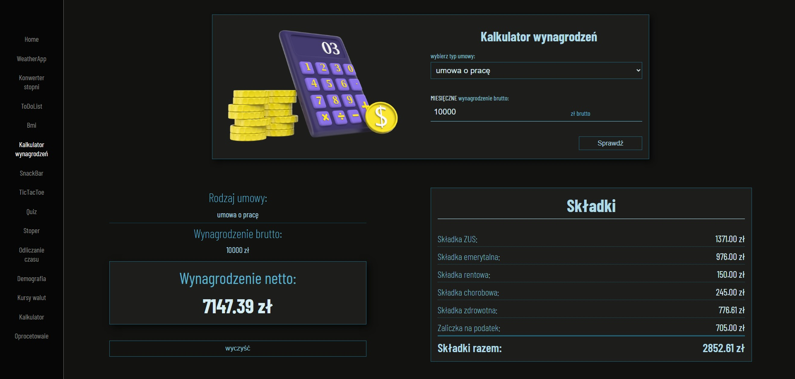

# The project contains 14 smaller projects

## live:

https://variousprojects.vercel.app/

### The technology used is:

- React
- TypeScript
- module.css

---

<h1 align="center">
Pages/Topics in the project:
</h1>

<h2>Project 1: Weather App</h2>
<p>Current weather for Polish cities and major cities on individual continents. Updated every 10 minutes.</p>


## Environment setup

### To run the project locally, you need to setup the `.env` file. Here are the steps:

### 1. Copy the `.env.example` file to `.env`:

### ```bash

### cp .env.example .env

### 2. Enter the API key into the .env file.

### 3. Install and run the project locally.

# --------------------

<h2>Project 2: Degree conventer</h2>
<p>Degree Converter. Check how many degrees ℃ is degrees ℉. Change and check how many ℉ is ℃.</p>


# --------------------

<h2>Project 3: ToDoList</h2>
<p>Advanced To-Do List. Data is saved in LocalStorage and can be stored on a given device.</p>


# --------------------

<h2>Project 4: BMI calculator</h2>
<p>The calculator not only shows the BMI, but also provides advice and shows the body shape appropriate to the index.</p>


# --------------------

<h2>Project 5: Salary calculator</h2>
<p>Calculate the net salary value from the gross salary for individual contract types, the amount of contributions and tax.</p>



# --------------------

<h2>Project 6: SnackBar</h2>
<p>Ordering products. Checking order quantity and price. Sending order.</p>


# --------------------

<h2>Project 7: TicTacToe</h2>
<p>Popular game of tic-tac-toe. Edit player names, list of moves made and info about the game result.</p>


# --------------------

Getting Started with Create React App

This project was bootstrapped with [Create React App](https://github.com/facebook/create-react-app).

# -------------------

## How to run

All commands are run from the root of the project, from a terminal:

| Command         | Action                                      |
| :-------------- | :------------------------------------------ |
| `npm install`   | Installs dependencies                       |
| `npm start`     | Starts local dev server at `localhost:3000` |
| `npm run build` | Build your production site to `./dist/`     |
